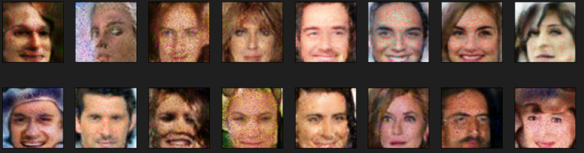

# Face-Generation

A deep learning project focused on generating realistic human faces using **Generative Adversarial Networks (GANs)**. This project was completed as part of the [Deep Learning Nanodegree Program by Udacity](https://www.udacity.com/course/deep-learning-nanodegree--nd101) and demonstrates advanced GAN techniques for high-fidelity image synthesis.

---

## 🌟 Project Overview

Generative Adversarial Networks (GANs) have revolutionized image generation by producing highly realistic images. This project implements **StyleGAN**, an advanced GAN architecture that improves upon traditional models such as DCGAN by introducing:

- Style-based modulation of the generator
- Progressive growing for stable training at higher resolutions
- Improved disentanglement of latent representations for better control

The model is trained on a subset of the **CelebA dataset**, which contains celebrity face images, to generate novel human faces from random latent vectors.

> **Note:** This repository is not divided into multiple commits as the project was completed entirely within Udacity's workspace environment.

---

## 📂 Repository Structure

```
Face-Generation/
├── dlnd_face_generation.ipynb  # Main notebook implementing StyleGAN
├── images/                      # Generated sample images and snapshots
├── requirements.txt             # Python dependencies for environment setup
├── README.md                    # Project documentation (this file)
├── my_generator.pth             # The weights of the trained model
├── processed-celeba-small.zip   # The subset of CelebA dataset
├── tests.py                     # Unit tests to ensure the correct functionality of models and data preprocessing
└── LICENSE                     # MIT License file
```
> You can use this structure as a guide and modify paths as needed.

---

## 🧠 StyleGAN Architecture

StyleGAN introduces several key innovations:

- **Mapping network:** Transforms the latent vector \( z \) into an intermediate latent space \( W \) to improve disentanglement.
- **Adaptive Instance Normalization (AdaIN):** Allows style control at different levels of image synthesis.
- **Noise injection:** Adds stochastic details to fine features for realism.
- **Progressive growing:** Gradually increases image resolution during training for stable learning.

The generator synthesizes high-resolution images by modulating styles at each convolutional layer based on the latent vector.

---

## 🖼️ Sample Results

Generated face samples from the trained StyleGAN model showcase realistic facial features, skin textures, and expressions:



---

## 📊 Dataset

- **Dataset:** Subset of the CelebA dataset (included or downloadable).
- **Preprocessing:** Images are cropped, resized to 64x64 pixels, and normalized to the range \([-1, 1]\).

> Please ensure the dataset is downloaded and prepared before training.

> **Dataset download link:** [Google Drive Folder](https://drive.google.com/drive/folders/1N08PhS-wT_DpLSoySOdNoY5DykYK8Nff?usp=sharing)

---

## ⚙️ Setup & Requirements

To run the project locally, follow these steps:

1. **Clone the repository:**

   ```bash
   git clone https://github.com/DiaeddinTahboub/Face-Generation.git
   cd Face-Generation
   ```

2. **Install dependencies:**

   ```bash
   pip install -r requirements.txt
   ```

3. **Run the notebook `dlnd_face_generation.ipynb`:**

   - Load and preprocess the dataset
   - Build the StyleGAN model architecture
   - Train the generator and discriminator
   - Visualize and save generated images

---

## ✅ Features

- Custom PyTorch implementation of StyleGAN
- Latent space sampling and interpolation techniques
- Modular, clean, and well-commented codebase
- Easily extendable to higher resolutions or other datasets

---

## 📚 References

- **StyleGAN Paper:** [A Style-Based Generator Architecture for GANs](https://arxiv.org/abs/1812.04948)
- **CelebA Dataset:** [Large-scale CelebFaces Attributes Dataset](http://mmlab.ie.cuhk.edu.hk/projects/CelebA.html)
- **Udacity Deep Learning Nanodegree**

---

## 📝 License

This project is licensed under the MIT License. See the [LICENSE](LICENSE) file for details.

---

## 🙌 Acknowledgements

This work was completed as part of the Udacity Deep Learning Nanodegree. Special thanks to the Udacity team and community for their support and feedback.
